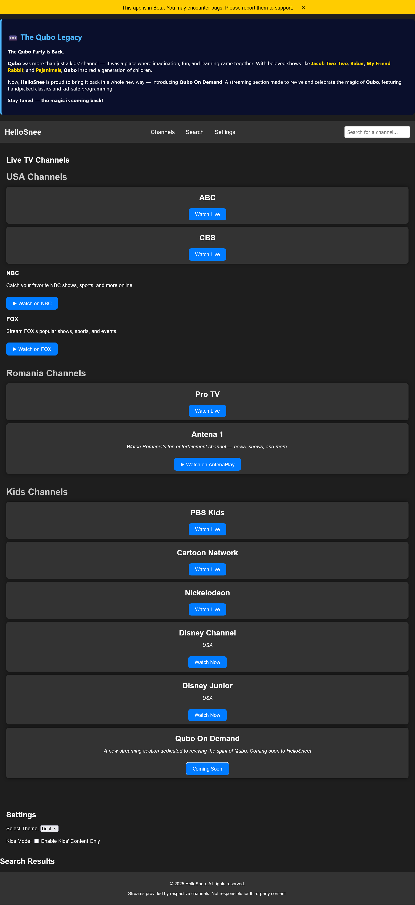

 
# HelloSnee Beta 1.0

**HelloSnee** is a nostalgic, browser-based streaming platform that brings back the charm of classic television. It features live streams of real US and Romanian TV channels, with a strong focus on kids' programming and legacy content like Qubo.

> ⚠️ **Currently in Beta 1.0** – bugs and issues may occur as features are still being tested and improved.

---

## 📄 Features
- Real live TV streams (no video files)
- Channels from the **USA** and **Romania**
- Categories: General, Kids, Legacy, and more
- Kids channels: Disney Channel, Disney Junior, and others
- Legacy section: Classic favorites like **Qubo**
- Custom error banners and beta warnings
- Clean and nostalgic UI inspired by old-school TV interfaces
- Desktop web app (HTML-based)

---

## ⚠️ Known Issues (Beta 1.0)
- Some channel streams may not load properly
- No channel logos yet
- "Close" button on error banner may not work
- Mobile support is limited

---

## ✨ Coming Soon
- Qubo On Demand (reviving Qubo content)
- Improved channel loading and stream handling
- Search and filtering options
- EXE and APK versions
- Custom media player interface

---

## 🔐 Legal & Safety Notice
This project does **not host** any copyrighted content. All streams are public links, and the platform is intended for educational and nostalgic purposes.

---
## 🚀 How to Use
1. Download or clone the repo
2. Open `HelloSnee.html` in your browser
3. Choose a channel from the list
4. Enjoy the stream!

